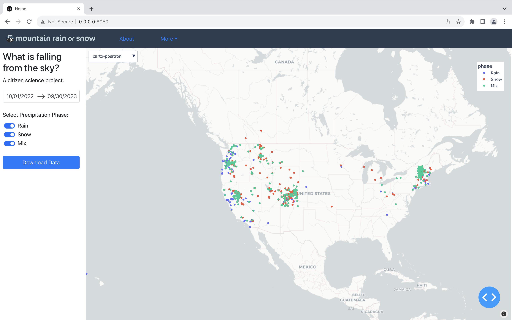

# Mountain Rain or Snow - Dashboard
A web app for displaying and downloading MROS data. This is the official platform for observers and the public to access and interact with the full dataset. 

The web map is updated with new observations daily. The daily snapshot is created by https://github.com/LynkerIntel/rainOrSnowTools, which queries the observer database and processes observations to generate the full suite of associated metadata. The full dataset is serialized as `.parquet` on the `mros` s3 bucket. The web app accesses this `.parquet` on startup. 

## Installation for development

1. clone the repo `git clone https://github.com/LynkerIntel/mros_webapp.git`
2. `conda create --name dss_dev --file requirements.txt` (or any python env)
3. `conda activate dss_dev` (or equivalent for env manager)
3. setup AWS credentials with access to the `mros` bucket. i.e. `~./aws/credentials`
4. `cd mros_webapp`
5. `python application.py`

# deployment
TODO: add deployment details

# application
